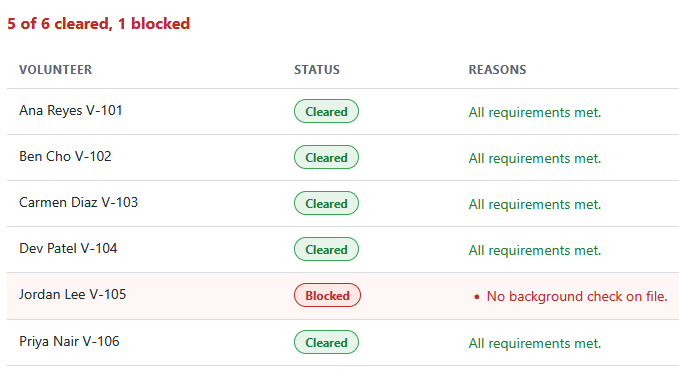
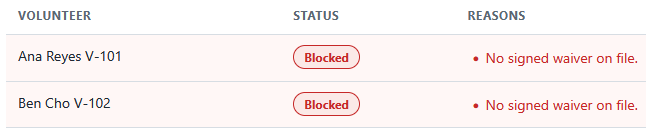

# Onboarding Eligibility Validator

A single page tool that checks a volunteer's completed requirements before they
are scheduled. It flags an under-age volunteer, a missing or expired background
check, any incomplete required training, and a missing or expired waiver. A
volunteer is cleared only when every requirement is met. Everything runs by
double-clicking the HTML file. No install, no build step, no server.

This is the first of three tools in the volunteer coordinator toolkit. It is the
gate the other scheduling work depends on: the cleared roster it produces is the
same roster the Shift Coverage Planner (tool 2) reads, so only cleared volunteers
can be scheduled.

## What it does

- Takes a roster of volunteers, by form, by file, or from the bundled samples.
- Runs each volunteer through the full set of onboarding rules.
- Shows a Cleared or Blocked badge per volunteer with the reasons, a count of
  cleared versus blocked, and the cleared roster the planner consumes.

Full details are in [spec.md](spec.md).

## Requirements

A web browser. Nothing else. The tool opens by double-clicking `index.html`.

## Files

- `eligibility_logic.js` is the pure logic: every onboarding rule. It does no
  DOM work, so it is easy to test. This is the formal home of the rules.
- `app.js` is the thin layer that reads the roster and renders the results.
- `index.html` is the page. `styles.css` styles it.
- `tests.html` runs the rules against hand-worked rosters and prints PASS or
  FAIL.
- `data/volunteers_sample.json` is the realistic roster: five clear, one is
  blocked.
- `data/volunteers_flagged.json` trips one of every flag.
- `data/cleared_roster.json` is the cleared roster the Shift Coverage Planner
  ships.

## How to use it

1. Double-click `index.html` to open it in your browser.
2. It opens with the sample roster loaded and checked. Five volunteers show a
   green **Cleared** badge and Jordan Lee shows a red **Blocked** badge for a
   missing background check.
3. Click **Load roster with problems**, to see the results table fill with one
   of every flag.
4. Edit any field, or use **Load roster file** to check a roster from a `.json`
   file.

## How to run the tests

Double-click `tests.html`. Each check runs the rules against a roster worked out
by hand, including the boundary cases and the sample roster. The summary line at
the top reads `passed, failed`.

## In action

The sample roster, checked. Five volunteers meet every requirement and clear.
Jordan Lee (V-105) is blocked for a missing background check, with the reason
named in line. The summary counts five cleared and one blocked.

The tool rejecting bad data. With the waiver date cleared on two volunteers,
both flip from cleared to blocked on the next check, each with the reason "No
signed waiver on file." A volunteer who is missing any single requirement does
not clear.

## How it connects to the planner

`data/cleared_roster.json` here is byte for byte the roster the Shift Coverage
Planner ships. Jordan Lee (V-105) is blocked here for a missing background check,
so he is `cleared: false` in that roster, and the planner refuses to let him fill
a shift. Clearing a volunteer here and scheduling them there are two views of the
same decision.

## Privacy

Any roster file you load is read in your browser with the `FileReader` API. Your
data stays on your machine and is never uploaded.
