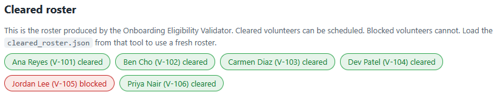
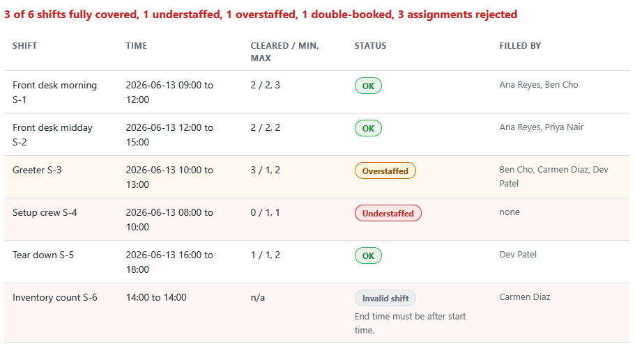
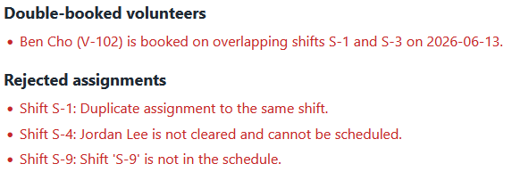

# Shift Coverage Planner

A single page tool that takes the shifts needing coverage and the volunteers
signed up for them, then flags understaffed and overstaffed shifts and any
volunteer double-booked across overlapping shifts. Only cleared volunteers count
toward coverage, so a shift cannot be filled by someone who is not cleared.
Everything runs by double-clicking the HTML file. No install, no build step, no
server.

This is the second of three tools in the volunteer coordinator toolkit. It reads
the cleared roster the Onboarding Eligibility Validator (tool 1) produces, so the
schedule only ever counts volunteers who passed onboarding.

## What it does

- Takes a schedule of shifts and the assignments of volunteers to them, by form
  or from the bundled sample.
- Counts only cleared volunteers toward each shift and marks it OK,
  understaffed, or overstaffed.
- Flags any volunteer booked on two overlapping shifts, and lists every
  assignment it had to reject, with the reason.

Full details are in [spec.md](spec.md).

## Requirements

A web browser. Nothing else. The tool opens by double-clicking `index.html`.

## Files

- `coverage_logic.js` is the pure logic: the coverage, overlap, and clearance
  rules. It does no DOM work, so it is easy to test.
- `app.js` is the thin layer that reads the schedule and renders the results.
- `index.html` is the page. `styles.css` styles it.
- `tests.html` runs the rules against a hand-worked schedule and prints PASS or
  FAIL.
- `data/shifts_sample.json` and `data/assignments_sample.json` are the sample
  schedule.
- `data/cleared_roster.json` is the cleared roster, byte for byte the file the
  Onboarding Eligibility Validator ships.

## How to use it

1. Double-click `index.html` to open it in your browser.
2. It opens with the sample schedule planned. The coverage table shows OK,
   understaffed, and overstaffed shifts, the double-booked panel names the one
   conflict, and the rejected panel lists the assignments that did not count.
3. Edit any shift or assignment and click **Plan coverage** to re-run.
4. Use **Load cleared roster file** to swap in a fresh `cleared_roster.json` from
   the Onboarding Eligibility Validator.

## How to run the tests

Double-click `tests.html`. Each check runs the rules against the sample schedule
worked out by hand, including the boundary cases and the cross-tool proof. The
summary line at the top reads `passed, failed`.

## In action

The cleared roster that drives the planner. It is the roster the Onboarding
Eligibility Validator produced. Five volunteers are cleared and Jordan Lee
(V-105) is blocked, so the planner will not count him toward any shift.

The coverage table for the sample schedule. Each shift counts only its cleared
volunteers against its min and max: two shifts are OK, the Greeter shift is
overstaffed, the Setup crew shift is understaffed at 0 of 1, and the Inventory
count shift is flagged invalid because its end time is not after its start.

The double-booked and rejected panels. Ben Cho is flagged for two overlapping
shifts. Three assignments are rejected, including Jordan Lee on the Setup crew
shift, because he is not cleared. That rejection is why the shift above sits
understaffed: an uncleared volunteer cannot fill it.

## How it connects to the validator

`data/cleared_roster.json` here is byte for byte the roster the Onboarding
Eligibility Validator produces. Jordan Lee (V-105) is blocked there for a missing
background check, so he is `cleared: false`. He is the only volunteer signed up
for the Setup crew shift, which needs one person. The planner rejects his
assignment and leaves the shift understaffed at `0 / 1, 1`. An uncleared
volunteer cannot fill a shift, and this is the worked example documented in
[spec.md](spec.md).

## Privacy

Any roster file you load is read in your browser with the `FileReader` API. Your
data stays on your machine and is never uploaded.
