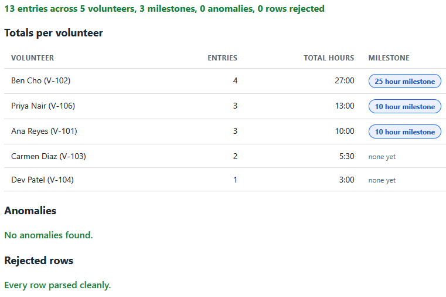
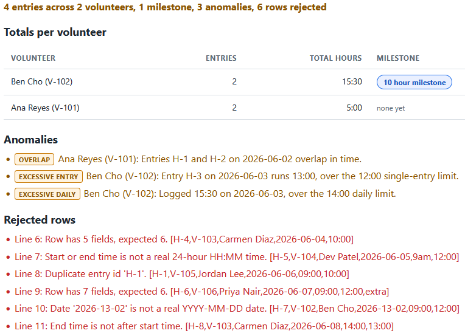

# Volunteer Hours Dashboard

A single page tool that loads a CSV of logged volunteer hours, totals the hours
for each volunteer, flags the recognition milestones they have crossed, and calls
out anomalies such as overlapping entries, an entry that runs too long, or too
many hours logged in one day. Everything runs by double-clicking the HTML file.
No install, no build step, no server.

This is the third of three tools in the volunteer coordinator toolkit. It stands
on its own, covering the separate job of tracking hours and recognizing
milestones for reporting and retention.

## What it does

- Reads a CSV of hour entries, by sample button or by file.
- Totals each volunteer's hours in whole minutes, so the numbers never drift,
  and shows them as `H:MM`.
- Flags milestones crossed, lists anomalies, and lists any row that did not parse
  with the reason, so the totals only count clean data.

Full details are in [spec.md](spec.md).

## Requirements

A web browser. Nothing else. The tool opens by double-clicking `index.html`.

## Files

- `hours_logic.js` is the pure logic: the CSV parser, the totals, the milestone
  rule, and the anomaly checks. It does no DOM work, so it is easy to test.
- `app.js` is the thin layer that reads the CSV and renders the dashboard.
- `index.html` is the page. `styles.css` styles it.
- `tests.html` runs the rules against hand-worked CSV and prints PASS or FAIL.
- `data/sample_hours.csv` is a clean log.
- `data/messy_hours.csv` carries one of every parse problem and every anomaly.

## How to use it

1. Double-click `index.html` to open it in your browser.
2. It opens with the sample data loaded. The totals table shows each volunteer's
   hours and milestone, and the anomaly and rejected panels are empty.
3. Click **Load data with problems** to see the messy file: four clean rows, six
   rejected rows named with their reasons, and three anomalies.
4. Use **Load CSV file** to load a log of your own in the same column order.

## How to run the tests

Double-click `tests.html`. Each check runs the rules against CSV worked out by
hand, including the clean sample and the messy file. The summary line at the top
reads `passed, failed`.

## In action

The sample log totaled. Each volunteer's hours are summed in whole minutes and
shown as H:MM. Ben Cho has crossed the 25 hour milestone, Priya Nair and Ana
Reyes the 10 hour milestone. The anomaly and rejected panels are clean because
every row parsed and nothing looks off.

The same dashboard on the messy file. The totals count only the four clean rows.
Three anomalies are tagged: an overlap, a single entry over the 12 hour limit,
and a day over the 14 hour limit. Six rows are rejected, each named with its line
number, the reason, and the raw text, so a bad row never reaches the totals.

## Where it sits in the toolkit

This tool tracks hours after volunteers have served. The volunteers here are the
same people the other two tools handle. Jordan Lee, blocked in the Onboarding
Eligibility Validator and refused a shift in the Shift Coverage Planner, never
appears in the clean hours, which fits a volunteer who was never cleared to
serve.

## Privacy

Any CSV you load is read in your browser with the `FileReader` API. Your data
stays on your machine and is never uploaded.
